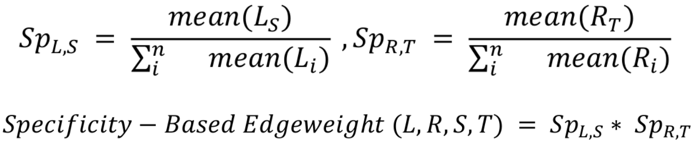

```{r setup, include=FALSE}
knitr::opts_chunk$set(echo = TRUE)
```

## Introduction

In biology, cells are not independent entities. They dynamically react to stimuli
from their environment, including such from other cells, and we we refer to those
as cell-cell communication events (CCC).
CCC events are essential for biological processes like apoptosis and
cell migration, and are hence essential in homeostasis, development, and disease.

As a consequence of the continuously growing popularity of dissociated and spatial
transcriptomics data, CCC inference is becoming a routine approach in transcriptomics
data analysis.

CCC commonly refers to interactions between secreted ligands and a corresponding plasma membrane receptor.
However, this picture can be broadened to include secreted enzymes, extra-cellular matrix proteins,
transporters, and interactions that require the physical contact between cells, 
such as cell-cell adhesion proteins and gap junctions. Furthermore, CCC is not independent
of other process, but rather the contrary, as intercellular interactions elicit a
downstream responses, including the induction of known pathways or transcription factors.
{width=60%}


## Set-up the Env

Before we start, we would need to install the LIANA framework packages that we will use:
[LIANA](https://saezlab.github.io/liana/) and [NicheNet](https://github.com/saeyslab/nichenetr).

```{r}
if(!require(liana)) remotes::install_github("saezlab/liana")
library(tidyverse)
library(liana)
```


#### Load the single-cell data but now as [Seurat](https://satijalab.org/seurat/) object
```{r, warning=FALSE, message=FALSE}
sobj <- readRDS("data/sobj.RDS")
```


## Ligand-Receptor Inference

We will first explore perhaps the most common and likely simplest methods, i.e.
those which aim to prioritize ligand-receptor interactions alone.

There is an ever-growing number of methods aimed at this particular inference task.
We recently have harmonized seven of them, along with 16 ligand-receptor resources
in the ligand-receptor framework [LIANA](https://saezlab.github.io/liana/articles/liana_tutorial.html).

```{r}
url = "https://media.springernature.com/full/springer-static/image/art%3A10.1038%2Fs41467-022-30755-0/MediaObjects/41467_2022_30755_Fig1_HTML.png?as=webp"
```

<center></center>

Often many of the ligand-receptor tools come in fixed combinations of method and
resource, and we will quickly run a couple of them via LIANA.
Namely [CellPhoneDB](https://www.nature.com/articles/s41596-020-0292-x) and 
[NATMI](https://www.nature.com/articles/s41467-020-18873-z), each with it's
corresponding resource.

As is commonly the case, we will apply those methods to predict interactions from
steady-state, or single-context data. More specifically, we will focus on inferring
the interactions thought to be most relevant among all cell types.

This, we need to first subsample the [Seurat](https://satijalab.org/seurat/)
object with COVID-19 infected blood cells alone.
```{r}
sobj_covid <- sobj[, sobj@meta.data$condition=="covid"]
# Remove erythroid cells
sobj_covid <- sobj_covid[, !str_detect(sobj_covid@meta.data$cell_type, "erythroid|Plasma")]
sobj_covid@meta.data$cell_type <- as.factor(sobj_covid@meta.data$cell_type)
```


### NATMI

We will first run NATMI, a method which in single-context data, proposes 
an example of a score which aims at inferring interaction specificity.
This is done under the assumption that interactions specific to a given
pair of cell types are more interesting than those shared between all cell types.

Q: Is this logic flawed? If you think it is, then is differential analysis between
cell types also flawed?

{width=50%}
(Adapted from Burmedi et al 2021, *Unpublished*)

```{r}
natmi_res <- liana_wrap(sobj_covid,
                        method = "natmi",
                        resource="connectomeDB2020") %>%
  rank_method(method_name = "natmi",
              mode = "specificity")
```

Plot the Results
```{r, warning=FALSE, fig.width=16, fig.height=12}
natmi_res %>%
  liana_dotplot(target_groups = c("Monocytes", "T cells", "B cells naive"),
                specificity ="edge_specificity",
                magnitude = "prod_weight",
                ntop = 20) +
  theme(axis.text.x = element_text(angle = 90, 
                                   vjust = 0.5,
                                   hjust= 0.5))

```

### Run CellPhoneDB

CellPhoneDB(v2) uses a permutation-based approach which reshuffles cell labels
in order to generate a Null distribution. This distribution is then used to
estimate p-values that represent the specificity of the interactions across all
cell types.

Hence, a typical usage of CellPhoneDB in a steady-state data would imply that 
one can focus on the mean expression between a ligand and receptor, subsequent
to filtering according to a significance threshold.

```{r}
cpdb_res <- liana_wrap(sobj_covid,
                       method = "cellphonedb",
                       resource="CellPhoneDB",
                       # lower the number of permutations
                       permutation.params = list(nperms = 100)
                       )
```
### Plot Results
```{r, fig.width=16, fig.height=12}
# identify interactions of interest
cpdb_int <- cpdb_res %>%
  # only keep interactions with p-val <= 0.05
  filter(pvalue <= 0.05) %>% # this reflects interactions `specificity`
  # then rank according to `magnitude` (`lr_mean` in this case)
  rank_method(method_name = "cellphonedb",
              mode = "magnitude") %>%
  # keep top 20 interactions (regardless of cell type)
  distinct_at(c("ligand.complex", "receptor.complex")) %>%
  head(20)

# Plot results
cpdb_res %>%
  # keep only the interactions of interest
  inner_join(cpdb_int, 
             by = c("ligand.complex",
                    "receptor.complex")
             ) %>%
  # invert size (low p-value/high specificity = larger dot size)
  # + add a small value to avoid Infinity for 0s
  mutate(pvalue = -log10(pvalue + 1e-10)) %>% 
  liana_dotplot(target_groups = c("Monocytes", "T cells", "B cells naive"),
                specificity = "pvalue",
                magnitude = "lr.mean",
                show_complex = TRUE,
                size.label = "-log10(p-value)") +
  theme(axis.text.x = element_text(angle = 90, 
                                   vjust = 0.5,
                                   hjust= 0.5))
```

Note the "_" - this is meant to separate subunits of heteromeric complexes.
Q: Why could this be important?


We also note that there is little agreement between our two runs, even though despite
their different algorithms, resources, and assumptions, both aim at predicting
the most relevant interactions.

In a recent publication, we saw that both the method and the resource of choice 
could affect the predictions that we get [Dimitrov el al., 2022](https://www.nature.com/articles/s41467-022-30755-0).

Q: Does that mean that we cannot trust CCC predictions?
(Not necessarily!)

### Using LIANA as a Consensus

Finally, we will use LIANA to generate a consensus score from multiple methods,
and we will use a Consensus resource, which is built from multiple literature-curated
ligand-receptor resources.

```{r, message=FALSE, warning=FALSE}
liana_res <- liana_wrap(sobj_covid,
                        resource = "Consensus",
                        verbose = FALSE,
                        # lower perms
                        permutation.params = list(nperms = 100)) %>%
  # aggregate the scores from each method
  liana_aggregate()

# these are liana's default parameters, so one can also just run:
# liana_res <- liana_wrap(sobj_covid)
```

We will now plot the results one last time.

By default, we use [SingleCellSignalR's](https://academic.oup.com/nar/article/48/10/e55/5810485) 
magnitude of expression of the ligand and receptor,
and NATMI’s specificity weights to show how specific a given interaction is to
the source(L) and target(R) cell types.

Also, the ligand-receptor interactions are now ordered by a consensus scores integrating
all methods implemented in LIANA, calculated with [robust rank aggregate](https://academic.oup.com/bioinformatics/article/28/4/573/213339).


```{r, warning=FALSE, fig.width=16, fig.height=12}
liana_res %>%
  liana_dotplot(target_groups = c("Monocytes", "T cells", "B cells naive"),
                ntop = 20) +
  theme(axis.text.x = element_text(angle = 90, 
                                   vjust = 0.5,
                                   hjust= 0.5))
```


## NicheNet

Load and Install NicheNet
```{r}
if(!require(nichenetr)) remotes::install_github("saeyslab/nichenetr")
library(nichenetr)
```

### NicheNet: studying cell-cell communication by bridging ligand-receptor infence tools and footprint approaches

NicheNet is a second type of approach to study cell-cell communication from scRNA-seq data. The first type of tools described here above are useful to get an extensive list of expressed / cell-type specific interactions between the different cell types in your data. However, the output is typically a very large list of possible ligand-receptor interactions between all cell types (cf output table of CellphoneDB, NATMI, Liana,...). Consequently, it is not immediately clear what the most important interactions are.

**NicheNet** (paper: https://www.nature.com/articles/s41592-019-0667-5; github: https://github.com/saeyslab/nichenetr) is a cell-cell communication algorithm that was developed to help prioritizing ligand-receptor interactions for further experimental validation. It does this by considering the **signaling effect** that these ligand-receptor interactions have. When a certain cell type ("sender cell type") produces a ligand that can bind to a receptor on the membrane of another cell type ("receiver cell type"), signal transduction pathways are activated, leading to changes in gene expression. The genes of which expression changes in response to a ligand-receptor interaction ("target genes") are typically specific for each ligand (family). 

```{r, echo=FALSE}
url = "https://saezlab.github.io/liana/articles/liana_nichenet.svg"
```
<center></center>

NicheNet uses this information then to look for whether there are **target genes** of expressed ligand-receptor pairs enriched in the receiver cell type after the cell-cell communication process. NicheNet thus ranks / prioritizes ligands based on the gene regulatory effect (**"ligand activity"**) they might have. 

<br><br>
{width=450}
<br><br>


To do this, NicheNet integrates prior knowledge of ligand-receptor, signaling and gene regulatory interactions to predict which ligands might regulate which target genes. This type of knowledge is then summarized in a prior model of ligand-target regulatory potential. This model is used in combination with expression data of your interacting cells to predict active ligands, and the specific target genes induced by them.

<br><br>

<br><br>

You might have noticed already the conceptual similarity between this NicheNet ligand activity prediction procedure other forms of footprint analyses, such as those implemented in declouper! Instead of pathway-gene associations, or TF-gene associations, NicheNet uses ligand-gene assocations: based on prior knowledge we can predict which genes might be regulated by which ligands -- and based on these associations NicheNet looks for enrichment in your data. It is most similar to the CytoSig Cytokine Activity prediction. The main difference with the CytoSig Cytokine Activity prediction is that NicheNet has ligand-gene associations for all ligands in the ligand-receptor database, whereas CytoSig provides this only for a limited number of Cytokines. This is because CytoSig is only based on experimental data: genes that are DE after stimulating cells in vitro are considered to be genes regulated by the cytokine/ligand. NicheNet uses this information as well, but makes also predictions based on other types of prior knowledge. Another difference is that NicheNet uses a probability model of target genes regulated by ligands, and that it does not provide a discrete model of which genes are a target, and which not (in contrast to most footprint approaches).

So to conclude, NicheNet combines the principles of ligand-receptor prediction tools with footprint prediction tools in one framework to study cell-cell interactions. It predicts 1) which ligands from one or more cell population(s) ("sender/niche") are most likely to affect target gene expression in an interacting cell population ("receiver/target") and 2) which specific target genes are affected by each of these prioritized ligands. 

One important final note before we go to applying NicheNet to our dataset. Because NicheNet studies how ligands affect gene expression in putatively neighboring/interacting cells, you need to have data about this effect in gene expression you want to study. So, there need to be 'some kind of' **differential expression in a receiver cell population**, caused by ligands from one of more interacting sender cell populations. In other words: you need to be able to define which genes in a receiver cell type are likely affected by cell-cell communication processes. Ideally, you have two or more conditions in your data, and gene expression differences can be attributed to differences in cell-cell communication processes (treatment vs control, knock-out vs wild type, etc.). In this tutorial, this requirement is fulfilled: we can compare communication between cells in COVID-19 and healthy patients.

### NicheNet application: predict driving interactions in COVID-19

! Note: in contrast to LIANA: NicheNet uses sender and receiver cells as terminology instead of source and target.

The pipeline of a basic NicheNet analysis consist mainly of the following steps:

* 0.) Load in the prior knowledge models of NicheNet: it's ligand-receptor network and ligand-target matrix
* 1.) **Define** which cell types you want to consider as **senders**, and which cell type as **receiver**
* 2.) Define a set of **ligands** that **potentially affect* your receiver population: these are ligands that are expressed by the sender cell population(s) and bind a (putative) receptor expressed by the receiver population 
* 3.) Define a **gene set of interest**: these are the genes in the receiver” cell population that are potentially affected by ligands expressed by interacting cells (e.g. genes differentially expressed upon cell-cell interaction)
* 4) Perform **NicheNet ligand activity analysis**: rank the potential ligands based on the presence of their target genes in the gene set of interest (compared to a background set of genes)
* 5) **Infer** top-predicted **target genes** of ligands that are top-ranked in the ligand activity analysis

This vignette guides you in detail through all these steps.

### NicheNet application without using LIANA's output

#### Step 0: Load in the prior knowledge models of NicheNet: it's ligand-receptor network and ligand-target matrix

As mention in the introduction here, NicheNet predicts important cell-cell communication processes through integration of known ligand-receptor, signaling and gene regulatory interactions. We very recently updated these networks, so we now have a NicheNet-v2 prior knowledge model (for human and mouse). You as participant of this workshop can already download these prior knowledge networks from Zenodo [](https://doi.org/10.5281/zenodo.7074291). If the connection to Zenodo would fail, you can find the objects required for this script also in the "nichenet_input" folder. 

A first object we will read in is the `ligand_target_matrix`: this matrix denotes the potential (based on prior knowledge) that a ligand might regulate the expression of a target genes, for all possible ligand-target gene pairs. This matrix is necessary to prioritize possible ligand-receptor interactions based on observed gene expression effects (i.e. NicheNet's ligand activity analysis) and infer affected target genes of these prioritized ligands.

A second object is the `lr_network`, which is the database of ligand-receptor interactions that we will use to define expressed ligands, receptors and their interactions.

A third object is the `weighted_networks`: this object contains the integrated ligand-receptor, signaling and gene-regulatory interactions. 

These different objects will be given as input to the NicheNet function later on.

```{r}
# ligand_target_matrix <- readRDS(url("https://zenodo.org/record/7074291/files/ligand_target_matrix_nsga2r_final.rds"))
ligand_target_matrix <- readRDS("data/nichenet_input/ligand_target_matrix_nsga2r_final.rds") # run this in case the connection to Zenodo does not work ("cannot open URL 'https://zenodo.org/record/3260758/files/ligand_target_matrix.rds': HTTP status was '502 Bad Gateway'")

ligand_target_matrix[1:5,1:5] # target genes in rows, ligands in columns

# lr_network <- readRDS(url("https://zenodo.org/record/7074291/files/lr_network_human_21122021.rds"))
lr_network <- readRDS("data/nichenet_input/lr_network_human_21122021.rds") # run this in case the connection to Zenodo does not work

head(lr_network)

# weighted_networks <- readRDS(url("https://zenodo.org/record/7074291/files/weighted_networks_nsga2r_final.rds"))
weighted_networks <- readRDS("data/nichenet_input/weighted_networks_nsga2r_final.rds") # run this in case the connection to Zenodo does not work
head(weighted_networks$lr_sig) # interactions and their weights in the ligand-receptor + signaling network
head(weighted_networks$gr) # interactions and their weights in the gene regulatory network
```


#### Step 1: **Define** which cell types you want to consider as **senders**, and which cell type as **receiver**

NicheNet predicts the ligands most likely be regulating expression in a receiver cell type of interest. Therefore, we will need to define one receiver cell type per NicheNet analysis.

```{r}
receiver <- "Monocytes"
```

As potential senders, we can take every cell type of interest: 

```{r}
sender_celltypes <- c("Monocytes","Neutrophils", "T cells", "Dendritic cells", "NK cells", "Platelets", "B cells naive")
```

#### Step 2: Define a set of **ligands** that **potentially affect* your receiver population: these are ligands that are expressed by the sender cell population(s) and bind a (putative) receptor expressed by the receiver population 

First, defines which genes are expressed in receiver and senders. In the default way described in the NicheNet vignettes, we look at the fraction of cells in a cell type that express a gene, and we consider genes to be expressed if the gene is expressed by a sufficiently large fraction of cells (eg 5% or 10%). In this tutorial, we put this threshold here at 5%.

```{r}
expressed_genes_receiver <- get_expressed_genes(receiver, sobj, pct = 0.05)
```

```{r}
list_expressed_genes_sender <- sender_celltypes %>% unique() %>% lapply(get_expressed_genes, sobj, 0.05) # lapply to get the expressed genes of every sender cell type separately here
expressed_genes_sender <- list_expressed_genes_sender %>% unlist() %>% unique()
```

Now filter out the ligands and receptors from the database to only include expressed ligand-receptor pairs. 

```{r}
## receiver
ligands <- lr_network %>% pull(from) %>% unique()
receptors <- lr_network %>% pull(to) %>% unique()

expressed_ligands <- intersect(ligands,expressed_genes_sender)
expressed_receptors <- intersect(receptors,expressed_genes_receiver)

potential_ligands <- lr_network %>% 
  filter(from %in% expressed_ligands & to %in% expressed_receptors) %>%
  pull(from) %>% unique()
```

Note: if you don't have information about sender cell types, you can choose all the ligands in the NicheNet database as potential_ligands. This is dan similar to the CytoSig Cytokine Activity prediction, but with a filter on receptors that should be expressed by the recever. 

#### Step 3: Define a **gene set of interest**: these are the genes in the receiver” cell population that are potentially affected by ligands expressed by interacting cells (e.g. genes differentially expressed upon cell-cell interaction)

In this step, we will use the DE results generated during the decoupler vignette, and use the same thresholds to define the DE genes in the receiver cell population. 

```{r}
DE_table <- readr::read_delim("data/deg.csv",delim = ",")
```

```{r}
geneset_oi <- DE_table %>%
  filter(contrast == receiver) %>%
  filter(pvals < 0.05 & abs(logFCs) > 0.50) %>%
  pull(name) %>%
  unique()
```

For the ligand acivity analysis, we also need to define the genomic background, which we choose here to be all genes in the receiver cell type considered for the DE analysis. 

```{r}
background_expressed_genes <- DE_table %>%
  filter(contrast == receiver) %>%
  pull(name) %>% unique()
```

Both our geneset of interest and background should only contain genes for which we have prior knowledge (so; that is part of our ligand-target matrix)

```{r}
print(setdiff(geneset_oi, rownames(ligand_target_matrix))) # which genes will not be considered
geneset_oi <- geneset_oi %>%
  .[. %in% rownames(ligand_target_matrix)]
background_expressed_genes <- background_expressed_genes %>%
  .[. %in% rownames(ligand_target_matrix)]
print(length(geneset_oi))
print(length(background_expressed_genes))
```

Note: we want to have good ratio of geneset of interest vs background (50-1000 genes vs 5000-20000 genes). This is here the case.

### Step 4: Perform NicheNet ligand activity analysis: rank the potential ligands based on the presence of their target genes in the gene set of interest (compared to the background set of genes)

To calculate ligand activities, we do the following: we will assess how well each ligand can predict which genes belong to the geneset of interest versus the background. Or in other words, we will assess whether genes with higher regulatory potential to be regulated by a ligand, are more likely to belong the geneset of interest. We assume that for active ligands, the target genes with high potential should be enriched in the geneset of interest. Mathematically we do the following: calculating the pearson correlation between the target gene regulatory potential vector of a ligand, and the vector that indicates whether a gene belongs to the geneset or not. Other metrics that are also calculated are the area under the precision-recall curve (aupr) and receiver operating characteristic curve (auroc). In our validation study, we showed that the pearson correlation coefficient was the most predictive measure of ligand activity for NicheNet-v1, but the AUPR for NicheNet-v2. If you are using the NicheNet-v2 networks and models as in this tutorial, we best use the AUPR to rank our ligands. (for the NicheNet-v1 model as currently shown in the github vignettes, this is thus based on the pearson correlation)

```{r}
ligand_activities <- predict_ligand_activities(geneset = geneset_oi, 
                                               background_expressed_genes = background_expressed_genes,
                                               ligand_target_matrix = ligand_target_matrix,
                                               potential_ligands = potential_ligands)

ligand_activities <- ligand_activities %>% 
  arrange(-aupr) %>% 
  mutate(rank = rank(desc(aupr)))

ligand_activities
```

NicheNet just ranks ligands during the ligand activity procedure. To check by which sender cell types these ligands are expressed, you can run:

```{r, fig.width=13}
best_upstream_ligands <- ligand_activities %>%
  top_n(30, aupr) %>% 
  arrange(-aupr) %>%
  pull(test_ligand) %>%
  unique()

Seurat::DotPlot(sobj, 
                features = best_upstream_ligands,
                cols = "RdYlBu") +
  Seurat::RotatedAxis()
```

### Step 5: Infer top-predicted target genes and receptors of ligands that are top-ranked in the ligand activity analysis

```{r}
active_ligand_target_links_df <- best_upstream_ligands %>%
  lapply(get_weighted_ligand_target_links,geneset = geneset_oi,
         ligand_target_matrix = ligand_target_matrix, n = 500) %>%
  bind_rows() %>% 
  drop_na()

active_ligand_target_links <- 
  prepare_ligand_target_visualization(ligand_target_df = active_ligand_target_links_df, 
                                      ligand_target_matrix = ligand_target_matrix,
                                      cutoff = 0.33)

order_ligands <- intersect(best_upstream_ligands,
                           colnames(active_ligand_target_links)) %>% rev() %>% make.names()
order_targets <- active_ligand_target_links_df$target %>%
  unique() %>% 
  intersect(rownames(active_ligand_target_links)) %>%
  make.names()
rownames(active_ligand_target_links) <- rownames(active_ligand_target_links) %>%
  make.names() # make.names() for heatmap visualization of genes like H2-T23
colnames(active_ligand_target_links) <- colnames(active_ligand_target_links) %>%
  make.names() # make.names() for heatmap visualization of genes like H2-T23

vis_ligand_target <- active_ligand_target_links[order_targets,order_ligands] %>%
  t()
```

```{r, fig.height= 7, fig.width = 14}
p_ligand_target_network <-  vis_ligand_target %>% 
  make_heatmap_ggplot("Prioritized ligands","Predicted target genes",
                      color = "purple",legend_position = "top", x_axis_position = "top",
                      legend_title = "Regulatory potential")  +
  theme(axis.text.x = element_text(face = "italic")) +
  scale_fill_gradient2(low = "whitesmoke",  high = "purple", breaks = c(0,0.0045,0.0090))
p_ligand_target_network
```

Now visualise the receptors of these ligands:
```{r}
weighted_networks_lr <-  weighted_networks$lr_sig %>%
  inner_join(lr_network %>% 
               distinct(from,to), by = c("from","to"))

lr_network_top <- lr_network %>% 
  filter(from %in% best_upstream_ligands & to %in% expressed_receptors) %>%
  distinct(from,to)
best_upstream_receptors <-  lr_network_top %>% pull(to) %>% unique()

lr_network_top_df_large <-  weighted_networks_lr %>%
  filter(from %in% best_upstream_ligands & to %in% best_upstream_receptors)

lr_network_top_df <-  lr_network_top_df_large %>%
  spread("from","weight",fill = 0)
lr_network_top_matrix <-  lr_network_top_df %>%
  select(-to) %>% as.matrix() %>%
  magrittr::set_rownames(lr_network_top_df$to)

dist_receptors <- dist(lr_network_top_matrix, method = "binary")
hclust_receptors <-  hclust(dist_receptors, method = "ward.D2")
order_receptors <-  hclust_receptors$labels[hclust_receptors$order]
    
dist_ligands <-  dist(lr_network_top_matrix %>% t(), method = "binary")
hclust_ligands <-  hclust(dist_ligands, method = "ward.D2")
order_ligands_receptor <-  hclust_ligands$labels[hclust_ligands$order]

order_receptors <- order_receptors %>% intersect(rownames(lr_network_top_matrix))
order_ligands_receptor <-  order_ligands_receptor %>%
  intersect(colnames(lr_network_top_matrix))

vis_ligand_receptor_network <-  lr_network_top_matrix[order_receptors, order_ligands_receptor]
rownames(vis_ligand_receptor_network) <-  order_receptors %>% make.names()
colnames(vis_ligand_receptor_network) <-  order_ligands_receptor %>% make.names()
```

```{r, fig.width= 11}
p_ligand_receptor_network <- vis_ligand_receptor_network %>% t() %>%
  make_heatmap_ggplot("Ligands","Receptors", color = "mediumvioletred",
                      x_axis_position = "top",legend_title = "Prior interaction potential")
p_ligand_receptor_network
```

#### NicheNet application with using LIANA's output

#### from Liana's output

In contrast to Liana, NicheNet ligand-receptor interactions are inferred when the ligand and receptor are just sufficiently expressed in the sender and the receiver. However, this can be prone to introduce some false positives. Therefore we can also limit the NicheNet ligand activity analysis to only those ligands that are part of cell-type specific interactions according to Liana. 

This is what we will show now. We just need to redefine the `potential_ligands`, rerun the NicheNet ligand activity analysis and the downstream visualizations.

```{r}
potential_ligands_liana <- liana_res %>% 
  filter(target == receiver) %>%
  separate_rows(ligand.complex, sep="[_]") %>%
  pull(ligand.complex) %>%
  unique() %>%
  intersect(colnames(ligand_target_matrix)) # only keep common ligands
```

Compare the list of potential ligands from the default NicheNet analysis to the one based on LIANA

```{r}
potential_ligands_liana %>% setdiff(potential_ligands) # unique for liana's ligands
potential_ligands %>% setdiff(potential_ligands_liana) # unique for NicheNet's ligands
```

```{r}
ligand_activities <- predict_ligand_activities(geneset = geneset_oi,
                                               background_expressed_genes = background_expressed_genes,
                                               ligand_target_matrix = ligand_target_matrix,
                                               potential_ligands = potential_ligands_liana)

ligand_activities <- ligand_activities %>%
  arrange(-aupr) %>%
  mutate(rank = rank(desc(aupr)))

ligand_activities
```
NicheNet just ranks ligands during the ligand activity procedure. To check by which sender cell types these ligands are expressed, you can run:
```{r, fig.width=13}
best_upstream_ligands_liana <- ligand_activities %>%
  top_n(30, aupr) %>%
  arrange(-aupr) %>%
  pull(test_ligand) %>%
  unique()

best_upstream_ligands_liana %>%
  setdiff(best_upstream_ligands) # unique for liana's ligands
best_upstream_ligands %>%
  setdiff(best_upstream_ligands_liana) # unique for NicheNet's ligands

Seurat::DotPlot(sobj, 
                features = best_upstream_ligands_liana, cols = "RdYlBu") +
  Seurat::RotatedAxis()
```

```{r}
active_ligand_target_links_df <- best_upstream_ligands_liana %>%
  lapply(get_weighted_ligand_target_links,geneset = geneset_oi,
         ligand_target_matrix = ligand_target_matrix, n = 500) %>%
  bind_rows() %>%
  drop_na()

active_ligand_target_links <- 
  prepare_ligand_target_visualization(ligand_target_df = active_ligand_target_links_df,
                                      ligand_target_matrix = ligand_target_matrix,
                                      cutoff = 0.33)

order_ligands <- intersect(best_upstream_ligands_liana,
                           colnames(active_ligand_target_links)) %>%
  rev() %>% make.names()
order_targets <- active_ligand_target_links_df$target %>%
  unique() %>% intersect(rownames(active_ligand_target_links)) %>%
  make.names()
rownames(active_ligand_target_links) <- rownames(active_ligand_target_links) %>%
  make.names() # make.names() for heatmap visualization of genes like H2-T23
colnames(active_ligand_target_links) <- colnames(active_ligand_target_links) %>%
  make.names() # make.names() for heatmap visualization of genes like H2-T23

vis_ligand_target <- active_ligand_target_links[order_targets,order_ligands] %>%
  t()
```

```{r, fig.height = 7, fig.width=14}
p_ligand_target_network <- vis_ligand_target %>%
  make_heatmap_ggplot("Prioritized ligands","Predicted target genes",
                      color = "purple",legend_position = "top",
                      x_axis_position = "top",legend_title = "Regulatory potential") + 
  theme(axis.text.x = element_text(face = "italic")) +
  scale_fill_gradient2(low = "whitesmoke",  high = "purple", breaks = c(0,0.0045,0.0090))
p_ligand_target_network
```

In a next step, we will add the ligand activities to the Liana output table. 

```{r}
liana_nichenet <- liana_res %>%
  filter(target == receiver) %>%
  left_join(ligand_activities %>%
              rename(ligand.complex = test_ligand,
                     rank_Nichenet = rank))
```
We will now visualize the top interactions prioritized by both methods. 

First, we will show LIANA's top 50 LR interactions towards the receiver cell type assessed in NicheNet, that are also supported with NicheNet prioritization (e.g. in top 30 of NicheNet's ligand activities)

```{r, warning=FALSE, fig.width=16, fig.height=20}
liana_nichenet %>% 
  filter(target == receiver & rank_Nichenet <= 30) %>%
  liana_dotplot(target_groups = receiver,
                ntop = 50) +
  theme(axis.text.x = element_text(angle = 90, 
                                   vjust = 0.5,
                                   hjust= 0.5))
```

Now we will show the opposite type of plot: show the NicheNet top 30 ligands, within their top 2 scoring pairs according to LIANA

```{r, warning=FALSE, fig.width=16, fig.height=15}
liana_nichenet %>% 
  filter(target == receiver & rank_Nichenet <= 30) %>%
  group_by(ligand.complex) %>%
  top_n(2, desc(aggregate_rank)) %>%
  liana_dotplot() +
  theme(axis.text.x = element_text(angle = 90, 
                                   vjust = 0.5,
                                   hjust= 0.5))
```

Note: the prioritization by Liana is made based on specificity, by NicheNet based on ligand activity. None of these two approaches ranks ligands based on their differential expression between COVID and normal, which could also be an interesting aspect to use for prioritization. Therefore, we will also add the DE information (covid vs normal) for the sender cell and receiver cell types because we expect that some of these active ligands might be upregulated (or their receptor(s)). We can thus use this information for even further filtering. 

```{r}
liana_nichenet <- liana_nichenet %>%
  left_join(DE_table %>%
              rename(source = contrast, ligand.complex = name,
                     logFC_ligand = logFCs, pval_ligand = pvals)) %>%
  left_join(DE_table %>% 
              rename(target = contrast, receptor.complex = name,
                     logFC_receptor = logFCs,
                     pval_receptor = pvals))

liana_nichenet %>%
  filter(logFC_ligand >= 0.5 |  logFC_receptor >= 0.5) %>%
  filter(rank_Nichenet <= 30)
```

Above, we ran over all the NicheNet analysis steps one-by-one. In practice, we also recommend users to first build a step-by-step pipeline of NicheNet. But for future easier use, you can make a wrapper around your pipeline. We did this here as well for this case study and will now quickly run the NicheNet for the other cell types.

### NicheNet analysis with wrapper

```{r}
source("src/nichenet_wrapper.R")
```

```{r}
nichenet_output_Tcells <- nichenet_covid19_wrapper(receiver = "T cells",
                                                   DE_table = DE_table,
                                                   sobj = sobj,  liana_res = liana_res,
                                                   ligand_target_matrix = ligand_target_matrix)
```

```{r, fig.width=13}
nichenet_output_Tcells$p_ligand_expression
```

```{r, fig.width=15, fig.height=7}
nichenet_output_Tcells$p_ligand_target_network
```

```{r, fig.width=15, fig.height=20}
nichenet_output_Tcells$p_liana_nichenet
```

```{r, fig.width=15, fig.height=15}
nichenet_output_Tcells$p_nichenet_liana
```

```{r}
nichenet_output_Tcells$liana_nichenet %>% filter(logFC_ligand >= 0.5 |  logFC_receptor >= 0.5) %>% filter(rank_Nichenet <= 30)
```


## Limitations and Assumptions

One should bear in mind that CCC inference from single-cell transcriptomics data comes with a number of assumptions and limitations,
particularly since there are multiple steps between expression and the actual occurrence of CCC event, since:

Gene expression is a only proxy of protein expression, activity, and secretion

At the same time we also make the assumptions of:
- Well mixed cell populations, hence physical distance between cell clusters and transport mechanisms (e.g. ligand diffusion) are neglected
- CCC also is often solely explained by gene expression, and hence via proteins, neglecting metabolic and mRNA exchange
- CCC inferred at the cluster level is meaningful


## Putting it all together

Q: What similarities and difference in biological interpretation do you observe between de diferent analyses you performed (footprint/enrichment, ligand-receptor prediction, NicheNet analysis)? Can you explain some of the differences?


## References

Browaeys, R., Saelens, W. and Saeys, Y., 2020. NicheNet: modeling intercellular communication by linking ligands to target genes. Nature methods, 17(2), pp.159-162.

Butler, A., Hoffman, P., Smibert, P., Papalexi, E. and Satija, R., 2018. Integrating single-cell transcriptomic data across different conditions, technologies, and species. Nature biotechnology, 36(5), pp.411-420.

Cabello-Aguilar, S., Alame, M., Kon-Sun-Tack, F., Fau, C., Lacroix, M. and Colinge, J., 2020. SingleCellSignalR: inference of intercellular networks from single-cell transcriptomics. Nucleic Acids Research, 48(10), pp.e55-e55.

Dimitrov, D., Türei, D., Garrido-Rodriguez, M., Burmedi, P.L., Nagai, J.S., Boys, C., Ramirez Flores, R.O., Kim, H., Szalai, B., Costa, I.G. and Valdeolivas, A., 2022. Comparison of methods and resources for cell-cell communication inference from single-cell RNA-Seq data. Nature Communications, 13(1), pp.1-13.

Hou, R., Denisenko, E., Ong, H.T., Ramilowski, J.A. and Forrest, A.R., 2020. Predicting cell-to-cell communication networks using NATMI. Nature communications, 11(1), pp.1-11.

Kolde, R., Laur, S., Adler, P. and Vilo, J., 2012. Robust rank aggregation for gene list integration and meta-analysis. Bioinformatics, 28(4), pp.573-580.

