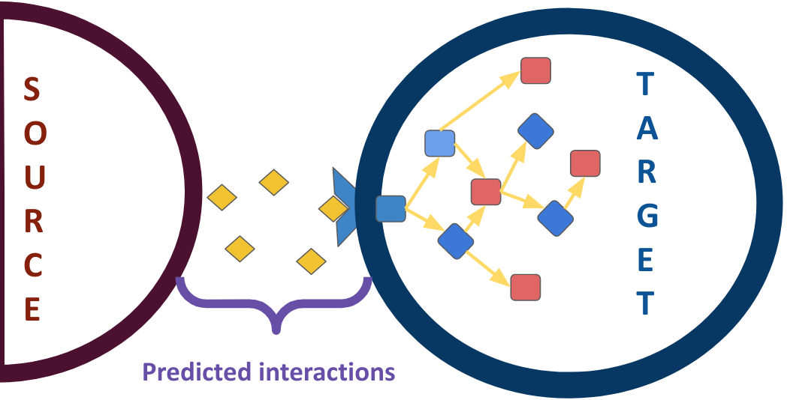
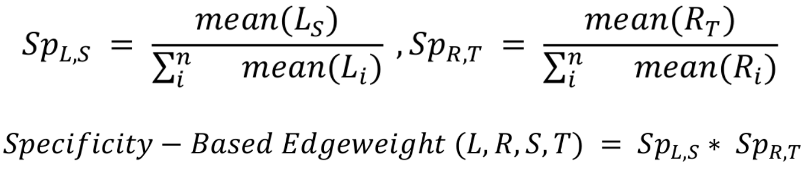
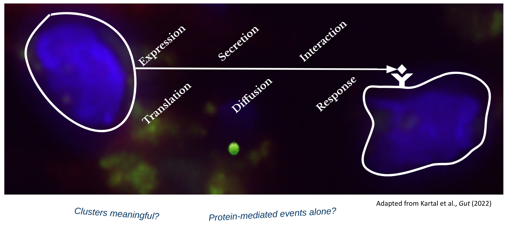

```{r setup, include=FALSE}
knitr::opts_chunk$set(echo = TRUE)
```

## Introduction

In biology, cells are not independent entities and they dynamically react to stimuli
from their environment, including such from other cells,  and we we refer to those
as cell-cell communication events (CCC).
CCC events are essential for biological processes like apoptosis and
cell migration, and are hence essential in homeostasis, development, and disease.

As a consequence of the continuously growing popularity of dissociated and spatial
transcriptomics data, CCC inference is becoming a routine approach in transcriptomics
data analysis.

CCC commonly refers to interactions between secreted ligands and a corresponding plasma membrane receptor.
However, this picture can be broadened to include secreted enzymes, extracellular matrix proteins,
transporters, and interactions that require the physical contact between cells, 
such as cell-cell adhesion proteins and gap junctions. Furtheremore, CCC is not independent
of other process, but rather the contrary, as intercellular interactions elicit a
downstream responses, including the induction of known pathways or transcription factors.
{width=60%}


## Set-up Env

Before we start we would need to install tidyverse (a user-friedly functional programming frameowrk),
and the two CCC packages that we will use: [LIANA](https://saezlab.github.io/liana/)
and [NicheNet](https://github.com/saeyslab/nichenetr).

```{r, message=FALSE, warning=FALSE}
if(!require(liana)) remotes::install_github("saezlab/liana", quiet = TRUE)
library(liana)
if(!require(nichenetr)) remotes::install_github("saeyslab/nichenetr", quiet = TRUE)
library(nichenetr)

if(!require(tidyverse)) install.packages("tidyverse")
library(tidyverse)
```


#### Load the single-cell data but now as [Seurat](https://satijalab.org/seurat/) object
```{r, warning=FALSE, message=FALSE}
sobj <- readRDS("data/sobj.RDS")
```


## Ligand-Receptor Inference

We will first explore perhaps the most common and likely simplest methods, i.e.
those which aim to prioritize ligand-receptor interactions alone.

There is an ever-growing number of methods aimed at this particular inference task.
We recently have harmonized seven of them, along with 16 ligand-receptor resources
in the ligand-receptor framework [LIANA](https://saezlab.github.io/liana/articles/liana_tutorial.html).

```{r}
url = "https://media.springernature.com/full/springer-static/image/art%3A10.1038%2Fs41467-022-30755-0/MediaObjects/41467_2022_30755_Fig1_HTML.png?as=webp"
```

<center></center>

Often many of the ligand-receptor tools come in fixed combinations of method and
resource, and we will quickly run a couple of them via LIANA.
Namely [CellPhoneDB](https://www.nature.com/articles/s41596-020-0292-x) and 
[NATMI](https://www.nature.com/articles/s41467-020-18873-z), each with it's
corresponding resource.

As is commonly the case, we will apply those methods to predict interactions from
steady-state, or single-context data. More specifically, we will focus on inferring
the interactions thought to be most relevant among all cell types.

This, we need to first subsample the [Seurat](https://satijalab.org/seurat/)
object with COVID-19 infected blood cells alone.
```{r}
sobj_covid <- sobj[, sobj@meta.data$condition=="covid"]
# Remove erythroid cells
sobj_covid <- sobj_covid[, !str_detect(sobj_covid@meta.data$cell_type, "erythroid|Plasma")]
sobj_covid@meta.data$cell_type <- as.factor(sobj_covid@meta.data$cell_type)
```


### NATMI

We will first run NATMI, a method which in single-context data, proposes 
an example of a score which aims at inferring interaction specificity.
This is done under the assumption that interactions specific to a given
pair of cell types are more interesting than those shared between all cell types.

Q: Is this logic flawed? If you think it is, then is differential analysis between
cell types also flawed?

{width=50%}
(Adapted from Burmedi et al 2021, *Unpublished*)

```{r}
natmi_res <- liana_wrap(sobj_covid,
                        method = "natmi",
                        resource="connectomeDB2020") %>%
  rank_method(method_name = "natmi",
              mode = "specificity")
```

Plot the Results
```{r, warning=FALSE, fig.width=16, fig.height=12}
natmi_res %>%
  liana_dotplot(target_groups = c("Monocytes", "T cells", "B cells naive"),
                specificity ="edge_specificity",
                magnitude = "prod_weight",
                ntop = 20) +
  theme(axis.text.x = element_text(angle = 90, 
                                   vjust = 0.5,
                                   hjust= 0.5))

```

### Run CellPhoneDB

CellPhoneDB(v2) uses a permutation-based approach which reshuffles cell labels
in order to generate a Null distribution. This distribution is then used to
estimate p-values that represent the specificity of the interactions across all
cell types.

Hence, a typical usage of CellPhoneDB in a steady-state data would imply that 
one can focus on the mean expression between a ligand and receptor, subsequent
to filtering according to a significance threshold.

```{r}
cpdb_res <- liana_wrap(sobj_covid,
                       method = "cellphonedb",
                       resource="CellPhoneDB",
                       # lower the number of permutations
                       permutation.params = list(nperms = 100)
                       )
```
### Plot Results
```{r, fig.width=16, fig.height=12}
# identify interactions of interest
cpdb_int <- cpdb_res %>%
  # only keep interactions with p-val <= 0.05
  filter(pvalue <= 0.05) %>% # this reflects interactions `specificity`
  # then rank according to `magnitude` (`lr_mean` in this case)
  rank_method(method_name = "cellphonedb",
              mode = "magnitude") %>%
  # keep top 20 interactions (regardless of cell type)
  distinct_at(c("ligand.complex", "receptor.complex")) %>%
  head(20)

# Plot results
cpdb_res %>%
  # keep only the interactions of interest
  inner_join(cpdb_int, 
             by = c("ligand.complex",
                    "receptor.complex")
             ) %>%
  # invert size (low p-value/high specificity = larger dot size)
  # + add a small value to avoid Infinity for 0s
  mutate(pvalue = -log10(pvalue + 1e-10)) %>% 
  liana_dotplot(target_groups = c("Monocytes", "T cells", "B cells naive"),
                specificity = "pvalue",
                magnitude = "lr.mean",
                show_complex = TRUE,
                size.label = "-log10(p-value)") +
  theme(axis.text.x = element_text(angle = 90, 
                                   vjust = 0.5,
                                   hjust= 0.5))
```

Note the "_" - this is meant to separate subunits of heteromeric complexes.
Q: Why could this be important?


We also note that there is little agreement between our two runs, even though despite
their different algorithms, resources, and assumptions, both aim at predicting
the most relevant interactions.

In a recent publication, we saw that both the method and the resource of choice 
could affect the predictions that we get [Dimitrov el al., 2022](https://www.nature.com/articles/s41467-022-30755-0).

Q: Does that mean that we cannot trust CCC predictions?
(Not necessarily!)


### Using LIANA as a Consensus

Finally, we will use LIANA to generate a consensus score from multiple methods,
and we will use a Consensus resource, which is built from multiple literature-curated
ligand-receptor resources.

```{r}
liana_res <- liana_wrap(sobj_covid,
                        resource = "Consensus",
                        verbose = FALSE,
                        # lower perms
                        permutation.params = list(nperms = 100)) %>%
  # aggregate the scores from each method
  liana_aggregate()

# these are liana's default parameters, so one can also just run:
# liana_res <- liana_wrap(sobj_covid)
```

We will now plot the results one last time.

By default, we use [SingleCellSignalR's](https://academic.oup.com/nar/article/48/10/e55/5810485) 
magnitude of expression of the ligand and receptor,
and NATMI’s specificity weights to show how specific a given interaction is to
the source(L) and target(R) cell types.

Also, the ligand-receptor interactions are now ordered by a consensus scores integrating
all methods implemented in LIANA, calculated with [robust rank aggregate](https://academic.oup.com/bioinformatics/article/28/4/573/213339).


```{r, warning=FALSE, fig.width=16, fig.height=12}
liana_res %>%
  liana_dotplot(target_groups = c("Monocytes", "T cells", "B cells naive"),
                ntop = 20) +
  theme(axis.text.x = element_text(angle = 90, 
                                   vjust = 0.5,
                                   hjust= 0.5))
```

## NicheNet


## Limitations and Assumptions

One should bear in mind that CCC inference from single-cell transcriptomics data comes with a number of assumptions and limitations,
particularly since there are multiple steps between expression and the actual occurrence of CCC event, since:

Gene expression is a only proxy of protein expression, activity, and secretion

At the same time we also make the assumptions of:
- Well mixed cell populations, hence physical distance between cell clusters and transport mechanisms (e.g. ligand diffusion) are neglected
- CCC also is often solely explained by gene expression, and hence via proteins, neglecting metabolic and mRNA exchange
- CCC inferred at the cluster level is meaningful




## References

Browaeys, R., Saelens, W. and Saeys, Y., 2020. NicheNet: modeling intercellular communication by linking ligands to target genes. Nature methods, 17(2), pp.159-162.

Butler, A., Hoffman, P., Smibert, P., Papalexi, E. and Satija, R., 2018. Integrating single-cell transcriptomic data across different conditions, technologies, and species. Nature biotechnology, 36(5), pp.411-420.

Cabello-Aguilar, S., Alame, M., Kon-Sun-Tack, F., Fau, C., Lacroix, M. and Colinge, J., 2020. SingleCellSignalR: inference of intercellular networks from single-cell transcriptomics. Nucleic Acids Research, 48(10), pp.e55-e55.

Dimitrov, D., Türei, D., Garrido-Rodriguez, M., Burmedi, P.L., Nagai, J.S., Boys, C., Ramirez Flores, R.O., Kim, H., Szalai, B., Costa, I.G. and Valdeolivas, A., 2022. Comparison of methods and resources for cell-cell communication inference from single-cell RNA-Seq data. Nature Communications, 13(1), pp.1-13.

Hou, R., Denisenko, E., Ong, H.T., Ramilowski, J.A. and Forrest, A.R., 2020. Predicting cell-to-cell communication networks using NATMI. Nature communications, 11(1), pp.1-11.

Kolde, R., Laur, S., Adler, P. and Vilo, J., 2012. Robust rank aggregation for gene list integration and meta-analysis. Bioinformatics, 28(4), pp.573-580.

